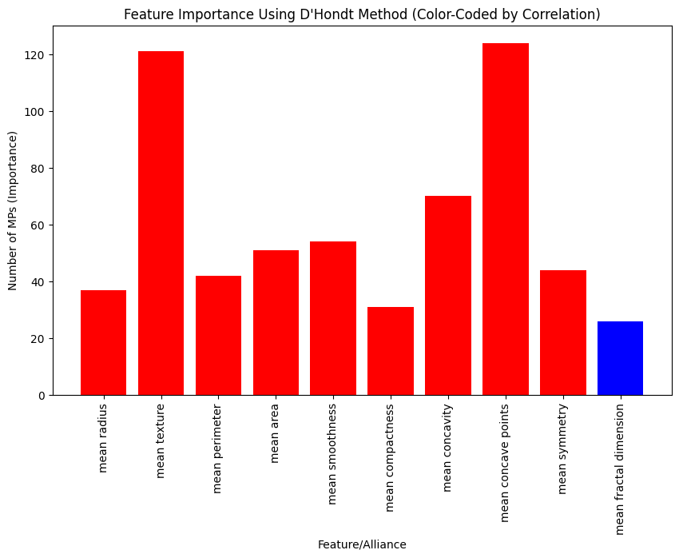
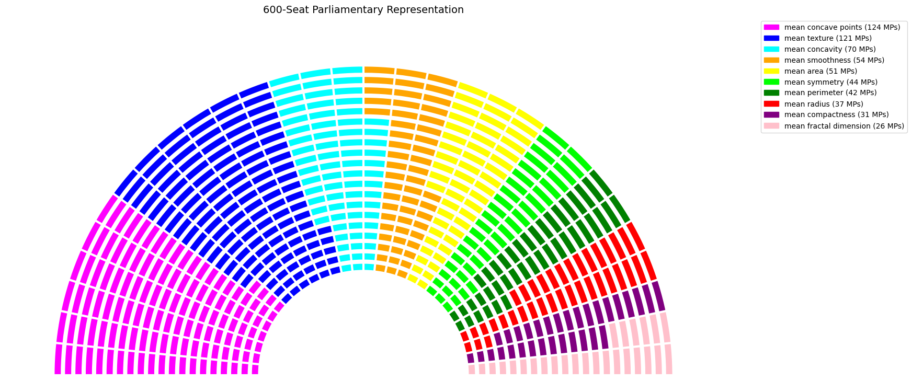

# DhondtXAI: Democratizing Explainable AI Through Proportional Feature Allocation

**DhondtXAI** is a Python library designed to facilitate explainability and feature allocation across various machine learning models. It visualizes and analyzes feature importance using democratic allocation methods like the D'Hondt method, making it particularly compatible with tree-based models (CatBoost, XGBoost, AdaBoost, Random Forest) and providing ease of use with each.

## General Features
- **Compatibility with Tree-Based Models**: Integrates seamlessly with popular tree-based machine learning algorithms such as CatBoost, XGBoost, AdaBoost, and Random Forest.
- **Explainability**: After the model is trained, it is possible to determine the importance of features and visualize these importance levels using democratic methods.
- **User-Friendly Interface**: The selection of alliances and the exclusion of variables is facilitated through a user-friendly interface.

## Installation

```bash
pip install dhondtxai
```

## Usage Guide

### 1. Train Your Model
The library allows training models such as CatBoost, XGBoost, AdaBoost, and Random Forest. Create a classifier using your chosen model type and train it with the training data.

### 2. Feature Analysis with DhondtXAI
Once the model is trained, you can use the DhondtXAI library to analyze and explain the model’s decision processes through feature analysis. While explaining this library, we will go through the Wisconsin Breast Cancer Dataset. The process of identifying, assigning, and visualizing important features follows these steps:

#### a. Initializing the DhondtXAI Class
Create a DhondtXAI object using your trained model:

```python
from dhondtxai import DhondtXAI

# Example model, e.g., CatBoost:
dhondt_xai = DhondtXAI(model)
```

#### b. Training the Model
Train your model using DhondtXAI with the training data:

```python
dhondt_xai.fit(X_train, y_train)
```

*Explanation*: This step completes the training of the model, making it capable of performing predictions and determining feature importance.

#### c. Feature Selection and Alliance Definition
Select variables, define alliances, and identify variables to exclude from analysis through the user interface:

```python
alliances, exclude_features = dhondt_xai.select_features(X.columns)
```

*User Input Explanation*:
- **Exclude Features**: Users can select features they want to exclude from evaluation. For example: `'mean radius', 'mean texture'` or use `'none'` to exclude no features.
- **Alliances**: Users can define alliances to group multiple features. For example: `'1,2 and 3'` or `'mean radius, mean texture and mean perimeter'`.

```sql
Available features:
1. mean radius
2. mean texture
3. mean perimeter
4. mean area
...
Enter the variables you want to exclude from the evaluation (e.g., '2, 4' or 'mean texture, mean area') or 'none': 
Enter any alliances between the variables (e.g., '2,3 and 4' or 'mean texture, mean perimeter and mean area') or 'none': 
```

#### d. D'Hondt Method Parameters
Gather parameters from the user, such as the total vote count, total number of seats, and threshold. Apply the D'Hondt method using these values:

```python
features, votes = dhondt_xai.apply_dhondt(
    num_votes=1000000000,
    num_mps=600,
    threshold=None,  # Threshold can be disabled with 'None'
    alliances=alliances,
    exclude_features=exclude_features
)
```

*User Input Explanation*:
- **Total Votes**: The total number of votes to be distributed among all features evaluated by the model. Example: `1000000000`
- **Total Seats**: The total number of representatives used to determine which features are prioritized using the D'Hondt method. Example: `600`
- **Threshold**: Checks if features exceed a certain threshold. If not specified, enter `'None'`.

```perl
Enter the total number of votes: 1000000000
Enter the total number of seats: 600
Enter the threshold (as a percentage) or 'None': none
```

#### e. Viewing D'Hondt Results
Display the results obtained using the D'Hondt method:

```python
print("Votes per Feature/Alliance:")
for feature, vote in zip(features, votes):
    print(f"{feature}: {int(vote)} votes")

# Allocate seats using the D'Hondt method
seats = dhondt_xai.dhondt_method(votes, num_mps)
print("
D'Hondt Method Results:")
for feature, seat in zip(features, seats):
    print(f"{feature}: {seat} MPs")
```

*Example Output*:

```yaml
Votes per Feature/Alliance:
mean radius: 6271130 votes
mean texture: 20068244 votes
...

D'Hondt Method Results:
mean radius: 37 MPs
mean texture: 121 MPs
...
```
#### f. Plotting Results Using plot_parliament

Visualize the MPs (seats) allocated to each feature using a bar plot, where the bar color indicates the correlation direction with the target variable:

```python
# Plot the results using plot_parliament
dhondt_xai.plot_results(features, seats)
```
- **Bar Plot**: Displays the number of MPs (importance) each feature received. This highlights which features have higher importance.
- **Color Coding** The bars are colored based on the correlation with the target variable:
  - **Blue:** Features positively correlated with the target variable.
  - **Red:** Features negatively correlated with the target variable.

### Feature Importance Using D'Hondt Method (Color-Coded by Correlation)


#### g. Visualizing Parliamentary Representation
Visualize the results as a parliament diagram:

```python
from dhondtxai import plot_parliament

plot_parliament(
    total_seats=num_mps,
    features=features,
    seats=seats,
    slices=30,  # Defines the number of slices across the semicircular parliament view
    additional_rows=10  # Adjusts the size of the empty inner circle in the parliament view
)
```

*Explanation*: This step visualizes the results determined by the D'Hondt method, presenting the number of votes and representatives of features/alliances graphically, in parliament view
  
  ### Parliamentary Representation Example


### 3. Compatible Models

- **CatBoost**: Directly supports feature analysis, one of the most popular tree-based models.
- **XGBoost**: A powerful tree-based algorithm commonly used with large datasets.
- **AdaBoost**: Suitable for quick and effective feature analysis, boosting weak learners.
- **Random Forest**: A robust model for feature combination and interaction, effective with large-scale datasets.

### 4. Citation
If you use DhondtXAI in your research or applications, please cite it as follows:

T. B. Donmez, "Explainable AI through a Democratic Lens: DhondtXAI for Proportional Feature Importance Using the D'Hondt Method," 2024. Available: [https://doi.org/10.48550/arXiv.2411.05196](https://doi.org/10.48550/arXiv.2411.05196)


## Conclusion
The DhondtXAI library is a flexible tool that provides feature allocation and importance ranking compatible with different machine learning models. It employs democratic methods like the D'Hondt method to create a more understandable and fair explanation model.
